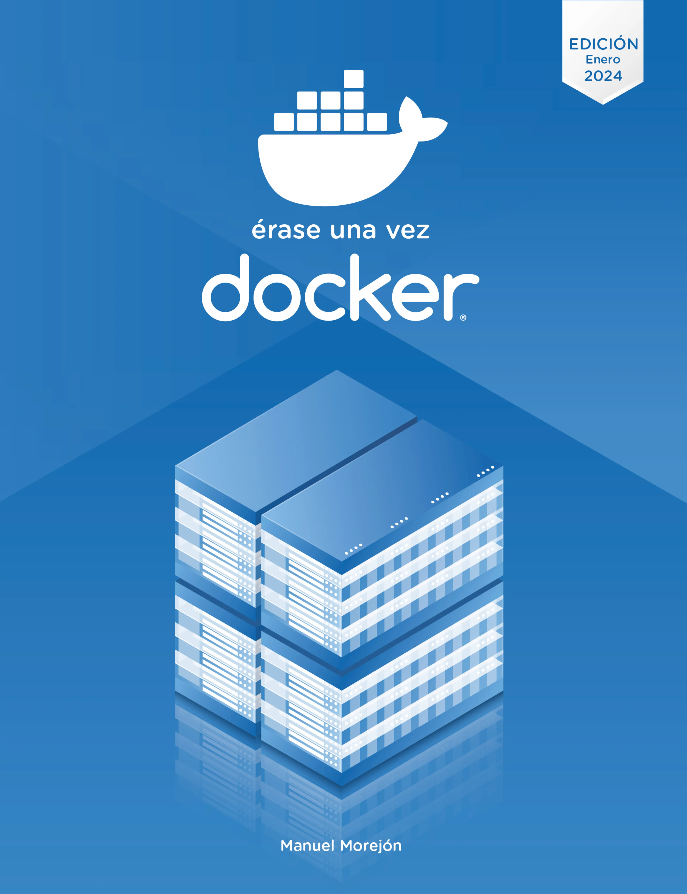

# Érase una vez Docker 🐳


<div align="center">



[](https://leanpub.com/erase-una-vez-docker)
[](https://www.amazon.es/dp/B0C47NWRG7)
[](LICENSE)

**Repositorio oficial de código y ejemplos del libro "Érase una vez Docker".**

</div>

## 📖 Sobre este repositorio

Si has llegado hasta aquí, probablemente estés buscando cómo **empezar con Docker desde cero** o necesites ejemplos prácticos de `Dockerfiles` y `docker compose`.

Este repositorio contiene **todo el código fuente, ejercicios y laboratorios** que acompañan al libro *Érase una vez Docker*. He liberado este código para que no tengas que copiar y pegar desde el PDF o el lector Kindle, y puedas centrarte en lo importante: **aprender haciendo**.

### ¿Qué encontrarás aquí?

El código está estructurado para seguir la progresión lógica del aprendizaje, desde tu primer contenedor "Hola Mundo" hasta orquestaciones complejas.

---

## 🚀 Requisitos Previos

Para ejecutar los ejemplos de este libro, necesitarás tener instalado un entorno de contenedores. El código es compatible con:

* **Docker Desktop** (Windows/Mac/Linux)

### Instalación rápida (Comprobación)

Asegúrate de que tienes las herramientas listas en tu terminal:

```bash
docker --version
docker compose version
```

---

## 📚 ¿Por qué necesitas el libro?

Tener el código es genial, pero **el código por sí solo no te explica el "porqué"**.

En el libro **"Érase una vez Docker"**, no solo te doy los comandos, sino que te enseño a pensar como un ingeniero DevOps:

* ✅ **Entenderás la arquitectura interna:** Namespaces, Cgroups y Union File Systems explicados de forma sencilla.
* ✅ **Buenas prácticas de seguridad:** Cómo crear imágenes ligeras y seguras (Distroless, Alpine, Multi-stage builds).
* ✅ **De Desarrollo a Producción:** El flujo de trabajo completo para llevar tus apps al mundo real.

Si quieres dejar de "copiar comandos" y empezar a **entender la tecnología**, consigue tu copia aquí:

| Plataforma | Formato | Enlace |
| :--- | :--- | :--- |
| **Amazon** | Kindle / Tapa Blanda | [👉 Ver en Amazon](https://www.amazon.es/dp/B0C47NWRG7) |
| **Leanpub** | PDF / EPUB (DRM Free) | [👉 Ver en Leanpub](https://leanpub.com/erase-una-vez-docker) |

> **💡 Pro Tip:** Si también te interesa Kubernetes, echa un vistazo al [Pack "Érase una vez Contenedores"](https://leanpub.com/b/erase-una-vez-contenedores) para conseguir ambos libros con descuento.

---

## 🛠️ Cómo usar este repositorio

1.  **Clona el proyecto:**
    ```bash
    git clone https://github.com/mmorejon/erase-una-vez-docker.git
    cd erase-una-vez-docker
    ```

2.  **Navega al capítulo que estés leyendo:**
    ```bash
    cd website
    ```

3.  **Ejecuta la magia:**
    ```bash
    docker image build -t website .
    ```

---

## 🤝 Contribuir y Soporte

Este es un proyecto vivo. La tecnología de contenedores avanza rápido, y este repositorio se actualiza para mantenerse al día.

* **¿Encontraste un error?** Abre un [Issue](https://github.com/mmorejon/erase-una-vez-docker/issues) y lo revisaremos.
* **¿Tienes dudas sobre el libro?** Puedes contactarme directamente en mis redes.

---

### Sobre el Autor

**Manuel Morejón**
*DevOps Engineer & Author*

Ayudo a ingenieros y empresas a adoptar tecnologías Cloud Native.

* 🌐 [Web Oficial](https://mmorejon.io)
* 💼 [LinkedIn](https://www.linkedin.com/in/manuelmorejon/)

---
*Si este repositorio te ha sido útil, considera darle una ⭐ estrella arriba a la derecha. ¡Ayuda a que más gente lo encuentre!*
